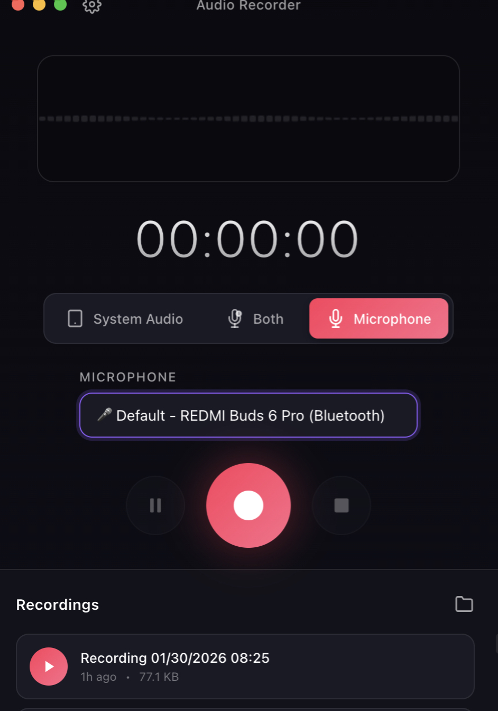

# Audio Recorder

A powerful macOS audio recording application built with Electron, designed for capturing meeting audio (Teams, Zoom, Google Meet, etc.) with built-in transcription support.



## Features

### 🎙️ Multiple Recording Modes

| Mode | Description | Best For |
|------|-------------|----------|
| **System Audio** | Records computer audio output | Capturing meeting participants |
| **Microphone** | Records from selected microphone | Recording your voice |
| **Both** | Mixes system audio + microphone | **Full meeting recording (recommended)** |

### 🛡️ Crash-Safe Recording

- **Streaming Architecture**: Audio data is flushed to disk every 5 seconds
- **Crash Recovery**: Automatically detects and recovers incomplete recordings after app restart
- **Atomic Save**: Recordings only appear in your folder when fully complete

### 📝 AI-Powered Transcription

- **OpenAI Whisper API**: Cloud-based, high accuracy
- **Local Whisper**: Privacy-first, runs on your machine (no internet required)
- **Auto-Fallback**: Automatically uses Local Whisper if no API key is configured

### 🎨 Beautiful Native UI

- macOS-native design with vibrancy effects
- Real-time audio waveform visualization
- Dark mode optimized
- Draggable title bar with standard window controls

## Installation

### Prerequisites

- macOS 10.15 (Catalina) or later
- [Node.js](https://nodejs.org/) 18+
- (Optional) [Python 3](https://www.python.org/) for Local Whisper transcription
- (Optional) [BlackHole](https://github.com/ExistentialAudio/BlackHole) virtual audio driver for best system audio quality

### Install from Source

```bash
# Clone the repository
git clone https://github.com/LHRchina/personal-ai-recorder.git
cd personal-ai-recorder

# Install dependencies
npm install

# Run in development mode
npm run dev

# Build for production
npm run build
```

### Install BlackHole (Recommended for System Audio)

```bash
# Using Homebrew
brew install blackhole-2ch

# Then create a Multi-Output Device in Audio MIDI Setup
# 1. Open Audio MIDI Setup (search in Spotlight)
# 2. Click + → Create Multi-Output Device
# 3. Check both BlackHole 2ch and your speakers/headphones
# 4. Right-click Multi-Output Device → Use This Device for Sound Output
```

## Usage

### Basic Recording

1. **Select Audio Source**
   - Click **System Audio**, **Both**, or **Microphone** button
   - For "Both" mode, select your microphone from the dropdown

2. **Start Recording**
   - Click the 🔴 **Record** button
   - Grant screen recording permission when prompted (for System Audio/Both modes)
   - Check "Share audio" in the screen picker dialog

3. **Stop Recording**
   - Click the ⏹️ **Stop** button
   - Recording is automatically saved to your recordings folder

### Transcription

1. Click the 🎙️ **Transcribe** button on any recording
2. Choose transcription method:
   - **OpenAI API**: Requires API key (set in Settings)
   - **Local Whisper**: Requires `pip install openai-whisper`
3. Wait for transcription to complete
4. Copy or save the transcribed text

### Settings

Click the ⚙️ **Settings** button to configure:

| Setting | Description |
|---------|-------------|
| OpenAI API Key | Your API key for cloud transcription (optional) |
| Transcription Method | Prefer OpenAI API or Local Whisper |
| Storage Location | Custom folder for recordings |

## Configuration

### OpenAI API Key (Optional)

If you want to use OpenAI's Whisper API for transcription:

1. Get an API key from [OpenAI Platform](https://platform.openai.com/api-keys)
2. Open Settings (⚙️) in the app
3. Paste your API key in the "OpenAI API Key" field
4. Click Save

> 💡 **Tip**: Leave the API key empty to use Local Whisper instead (free, runs locally).

### Install Local Whisper (Optional)

For offline transcription without API key:

```bash
pip install openai-whisper
```

The app will automatically detect and use Local Whisper if available.

## Data Locations

| Data Type | Location |
|-----------|----------|
| Recordings | `~/Library/Application Support/audio-recorder/recordings/` |
| Settings | `~/Library/Application Support/audio-recorder/settings.json` |
| Temp Files | `~/Library/Application Support/audio-recorder/temp_recordings/` |

## Troubleshooting

### Settings Button Not Clickable

**Fixed in latest version.** The settings button now properly handles clicks in the draggable title bar.

### No System Audio

1. Grant **Screen Recording** permission:
   - System Preferences → Privacy & Security → Screen Recording
   - Check "Audio Recorder"
   - Restart the app

2. Install BlackHole (recommended for best quality)

### Transcription Not Working

**Option A - Use OpenAI API:**

- Add your API key in Settings

**Option B - Use Local Whisper:**

```bash
pip install openai-whisper
```

### Recording Stops Unexpectedly

- Check available disk space
- For long meetings (>2 hours), ensure stable system resources
- The app has built-in crash recovery - restart to recover partial recordings

## Architecture

```
┌─────────────────────────────────────────────────────────┐
│                     Electron App                         │
├─────────────────────────────────────────────────────────┤
│  Main Process          │  Renderer Process              │
│  - IPC handlers         │  - UI components              │
│  - File operations      │  - Audio capture              │
│  - FFmpeg conversion    │  - Visualization              │
│  - Transcription API    │  - Streaming logic            │
└─────────────────────────────────────────────────────────┘
                          │
    ┌─────────────────────┼─────────────────────┐
    ▼                     ▼                     ▼
┌─────────┐        ┌──────────┐        ┌──────────────┐
│  FFmpeg │        │  Python  │        │  Web Audio   │
│  (audio │        │  Whisper │        │  API         │
│   conv) │        │  (trans) │        │  (capture)   │
└─────────┘        └──────────┘        └──────────────┘
```

## Contributing

Contributions are welcome! Please read [PROJECT_FEATURES.md](PROJECT_FEATURES.md) for detailed architecture documentation.

## License

MIT License - see LICENSE file for details.

## Acknowledgments

- [Electron](https://www.electronjs.org/) - Cross-platform desktop apps
- [Whisper](https://github.com/openai/whisper) - OpenAI's speech recognition model
- [BlackHole](https://github.com/ExistentialAudio/BlackHole) - Virtual audio driver
- [FFmpeg](https://ffmpeg.org/) - Audio processing

---

**Made with ❤️ for better meeting recordings**
